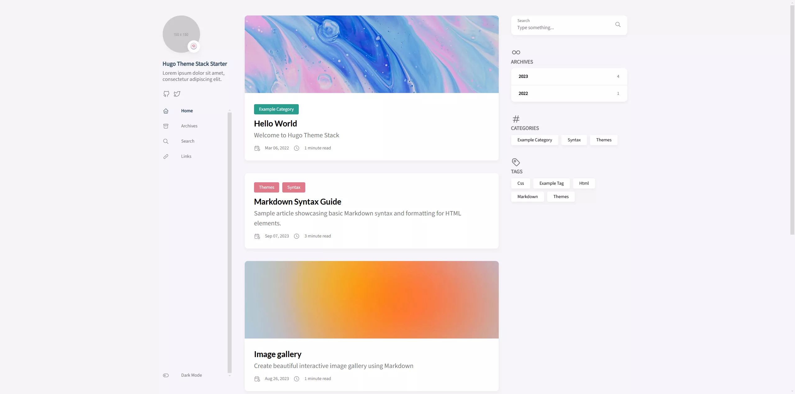
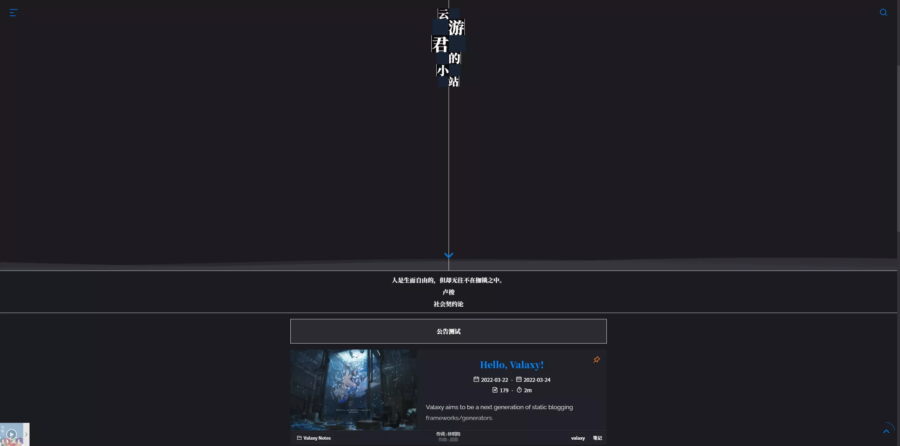
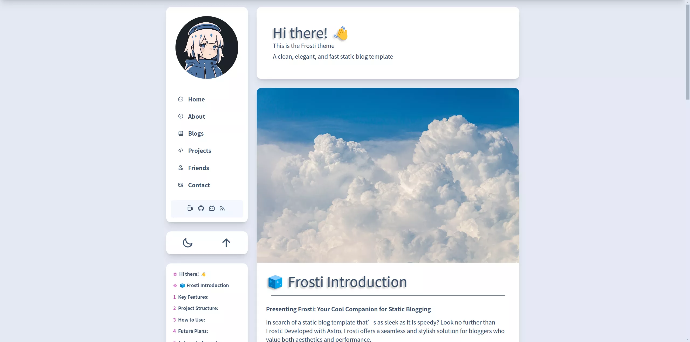
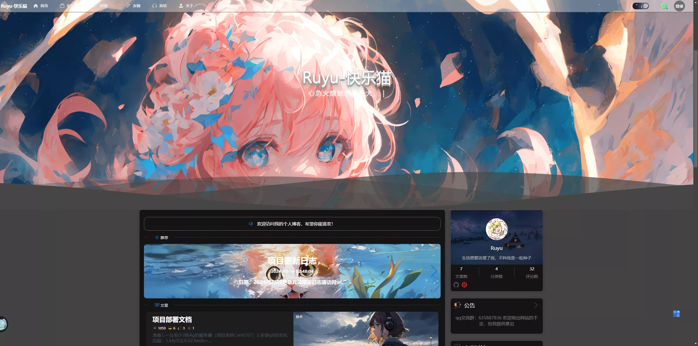
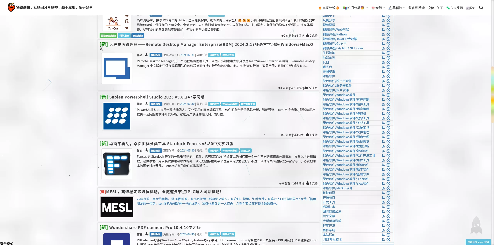
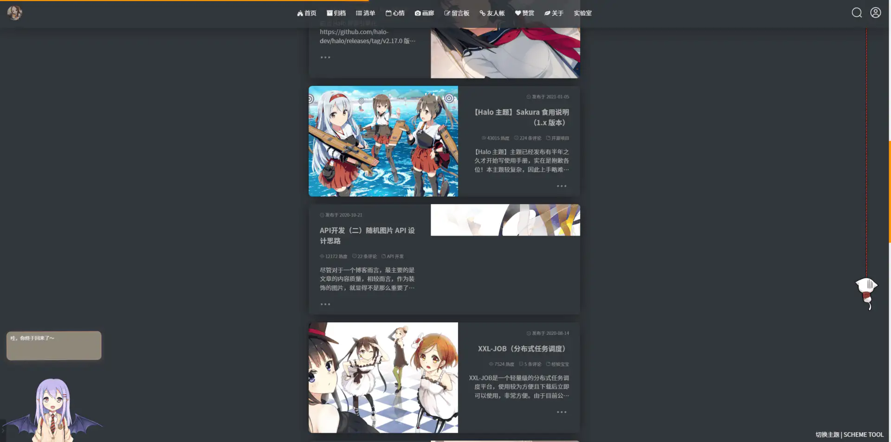
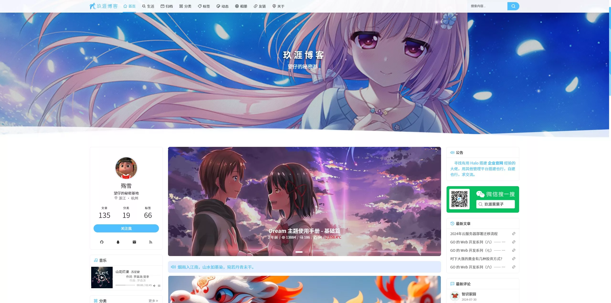
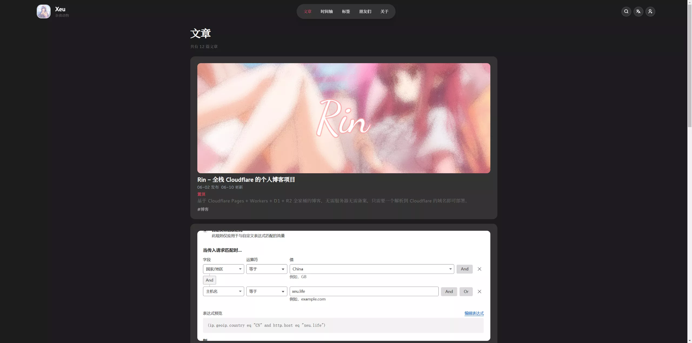
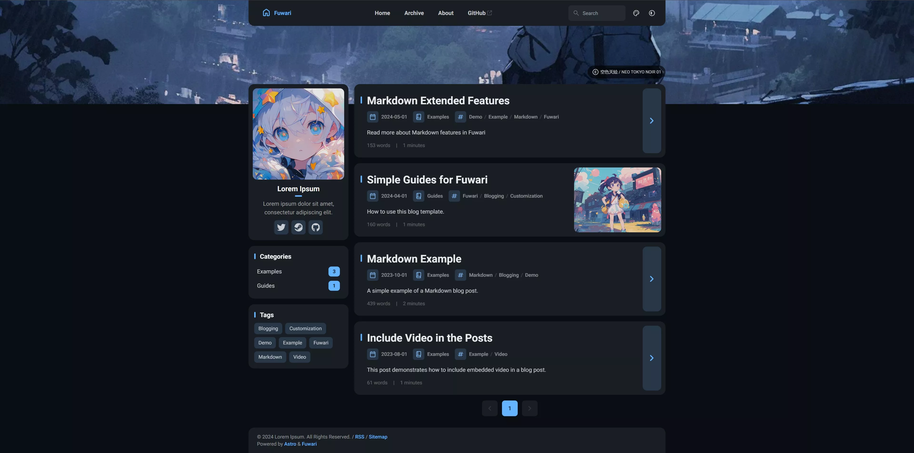

# awesome-blog-themes

[中文](./README_zh.md)

## Hexo themes

> Hexo is a fast, simple & powerful blog framework. Recommended for beginners 👍

### [anzhiyu](https://github.com/anzhiyu-c/hexo-theme-anzhiyu)

### [aurora](https://github.com/auroral-ui/hexo-theme-aurora)

### [redefine](https://github.com/EvanNotFound/hexo-theme-redefine)

### [shokaX](https://github.com/theme-shoka-x/hexo-theme-shokaX)

### [stellar](https://github.com/xaoxuu/hexo-theme-stellar)

### [volantis](https://github.com/volantis-x/hexo-theme-volantis)

### [Fomalhaut](https://github.com/fomalhaut1998/hexo-theme-Fomalhaut)

### [icarus](https://github.com/imaegoo/hexo-theme-icarus)

### [Kratos-Rebirth](https://github.com/Candinya/Kratos-Rebirth)

### [particlex](https://github.com/argvchs/hexo-theme-particlex)

### [archer](https://github.com/fi3ework/hexo-theme-archer)

### [nexmoe](https://github.com/theme-nexmoe/hexo-theme-nexmoe)

## The following themes are not for hexo, but they are worth a try (Some may require you to deploy it yourself)

### (Hugo) [stack](https://github.com/CaiJimmy/hugo-theme-stack)

### (Valaxy) [yun](https://github.com/YunYouJun/valaxy)

### (astro) [Frosti](https://github.com/EveSunMaple/Frosti)

### (Java + Vue) [Ruyu](https://github.com/kuailemao/Ruyu-Blog)

### (DotNet) [Masuit](https://github.com/ldqk/Masuit.MyBlogs)

### (Halo) [Sakura](https://github.com/LIlGG/halo-theme-sakura)

### (Halo) [Dream](https://github.com/nineya/halo-theme-dream)

### (TypeScript) [Shiro](https://github.com/innei/Shiro)

### (Cloudflare) [Rin](https://github.com/openRin/Rin)

### (Astro) [fuwari](https://github.com/saicaca/fuwari)

## Q: Is there any theme available for wordpress？

A: No. WordPress has far more themes than Hexo, and many of them are proprietary.

## PS:

If you have a better theme, please submit a PR.
