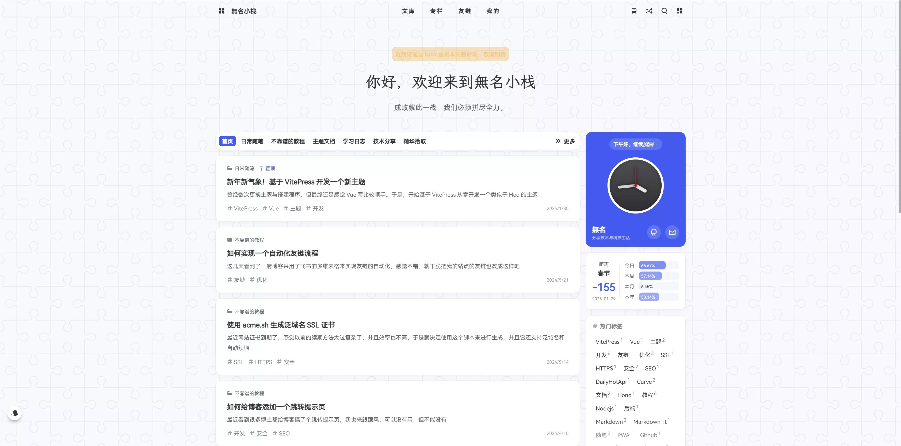

# awesome-blog-themes

## Hexo themes

Hexo is a fast, simple & powerful blog framework.

It is also known for its beginner-friendly configuration system.

| Theme | Preview |
| ----- | ------- |
| [anzhiyu](https://github.com/anzhiyu-c/hexo-theme-anzhiyu) |  |
| [aurora](https://github.com/auroral-ui/hexo-theme-aurora) |  |
| [redefine](https://github.com/EvanNotFound/hexo-theme-redefine) |  |
| [shokaX](https://github.com/theme-shoka-x/hexo-theme-shokaX) |  |
| [stellar](https://github.com/xaoxuu/hexo-theme-stellar) |  |
| [volantis](https://github.com/volantis-x/hexo-theme-volantis) |  |
| [Fomalhaut](https://github.com/fomalhaut1998/hexo-theme-Fomalhaut) |  |
| [icarus](https://github.com/imaegoo/hexo-theme-icarus) |  |
| [Kratos-Rebirth](https://github.com/Candinya/Kratos-Rebirth) |  |
| [particlex](https://github.com/argvchs/hexo-theme-particlex) |  |
| [butterfly](https://github.com/jerryc127/hexo-theme-butterfly) |  |
| [archer](https://github.com/fi3ework/hexo-theme-archer) |  |
| [nexmoe](https://github.com/theme-nexmoe/hexo-theme-nexmoe) |  |
| [suka](https://github.com/SukkaW/hexo-theme-suka) |  |
| [flexblock](https://github.com/miiiku/hexo-theme-flexblock) |  |

## Hugo

Hugo is a fast and modern static site generator written in Go.

| Theme | 预览 |
| ----- | ---- |
| [stack](https://github.com/CaiJimmy/hugo-theme-stack) |  |
| [narrow](https://github.com/tom2almighty/hugo-narrow) |  |
| [PaperMod](https://github.com/adityatelange/hugo-PaperMod) |  |

## Lume

Lume is a static site generator for Deno, built with TypeScript.

| Theme | 预览 |
| ----- | ---- |
| [LumeProse](https://github.com/FBIKdot/LumeProse) |  |

## React

React-based blog platforms offer modern development experience with type safety.

| Theme | 预览 |
| ----- | ---- |
| [Shiro](https://github.com/innei/Shiro) |  |

## Ghost

Ghost is a modern, open source publishing platform.

| Theme | 预览 |
| ----- | ---- |
| [attila](https://github.com/zutrinken/attila) |  |

## Astro

Astro is an all-in-one web framework for building fast, content-focused websites.

| Theme | 预览 |
| ----- | ---- |
| [Frosti](https://github.com/EveSunMaple/Frosti) |  |
| [fuwari](https://github.com/saicaca/fuwari) |  |
| [Mizuki](https://github.com/matsuzaka-yuki/Mizuki) |  |
| [fuwari-fork](https://github.com/afoim/fuwari) |  |
| [Firefly](https://github.com/CuteLeaf/Firefly) |  |
| [astro-paper](https://github.com/satnaing/astro-paper) |  |
| [astro-antfustyle-theme](https://github.com/lin-stephanie/astro-antfustyle-theme) |  |
| [pure](https://github.com/cworld1/astro-theme-pure) |  |

## Java + Vue

Full-stack blog solutions with Java backend and Vue frontend.

| Theme | 预览 |
| ----- | ---- |
| [Ruyu](https://github.com/kuailemao/Ruyu-Blog) |  |

## Vue

Full-stack blog solutions with a Vue frontend.

| Theme | 预览 |
| ----- | ---- |
| [valaxy](https://github.com/YunYouJun/valaxy) |  |

## Java + Vue

Full-stack blog solutions with Java backend and Vue frontend.

| Theme | 预览 |
| ----- | ---- |
| [Ruyu](https://github.com/kuailemao/Ruyu-Blog) |  |

## DotNet + Vue

.NET-based blog platforms.

| Theme | 预览 |
| ----- | ---- |
| [Masuit](https://github.com/ldqk/Masuit.MyBlogs) |  |

## Svelte

Svelte blog systems.

| Theme | 预览 |
| ----- | ---- |
| [Swyxkit](https://github.com/swyxio/swyxkit) |  |

## Halo

Halo is a modern open source CMS for developers.

| Theme | 预览 |
| ----- | ---- |
| [Sakura](https://github.com/LIlGG/halo-theme-sakura) |  |
| [Dream](https://github.com/nineya/halo-theme-dream) |  |

## Cloudflare

Cloudflare Workers based blog platforms.

| Theme | 预览 |
| ----- | ---- |
| [Rin](https://github.com/openRin/Rin) |  |

## Vitepress

VitePress is a Vue-powered static site generator.

| Theme | 预览 |
| ----- | ---- |
| [curve](https://github.com/imsyy/vitepress-theme-curve) |  |

## Jekyll

Jekyll is a simple, blog-aware static site generator.

| Theme | 预览 |
| ----- | ---- |
| [chirpy](https://github.com/cotes2020/jekyll-theme-chirpy) |  |

## Q: Is there any theme available for Wordpress (or Typecho)？

A: No. WordPress has far more themes and functions compared with static blog sites, everyone has their own favorite style.

## Contribution

If you want to promote your theme, feel free to submit a PR.
