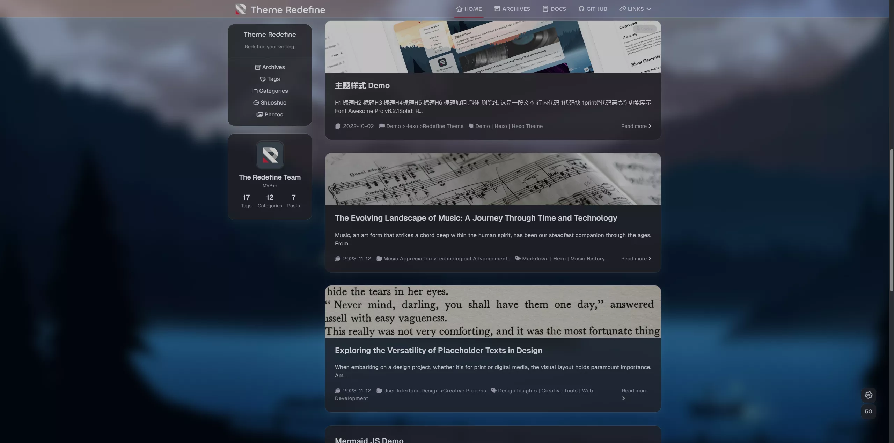
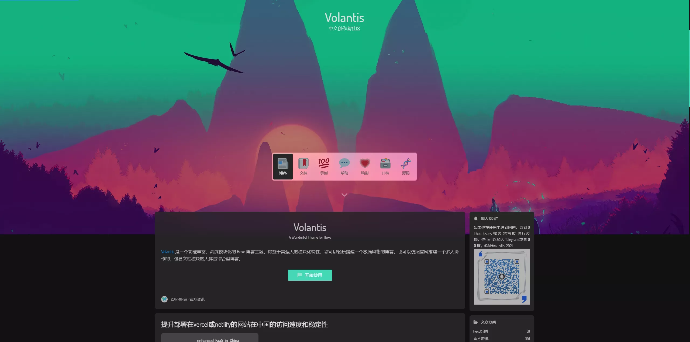
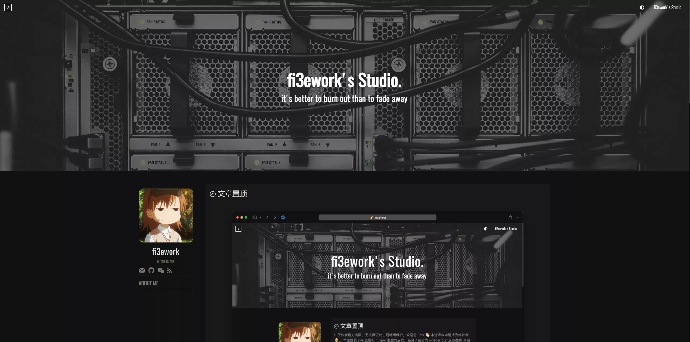

# 下面是我搜集一些好看的博客主题！

## 几款好看的 hexo 主题~

### [anzhiyu](https://github.com/anzhiyu-c/hexo-theme-anzhiyu)

### [aurora](https://github.com/auroral-ui/hexo-theme-aurora)

### [redefine](https://github.com/EvanNotFound/hexo-theme-redefine)

### [shokaX](https://github.com/theme-shoka-x/hexo-theme-shokaX)

### [stellar](https://github.com/xaoxuu/hexo-theme-stellar)

### [vivia](https://github.com/saicaca/hexo-theme-vivia)

### [volantis](https://github.com/volantis-x/hexo-theme-volantis)

### [Fomalhaut](https://github.com/fomalhaut1998/hexo-theme-Fomalhaut)

### [icarus](https://github.com/imaegoo/hexo-theme-icarus)

### [Kratos-Rebirth](https://github.com/Candinya/Kratos-Rebirth)

### [particlex](https://github.com/argvchs/hexo-theme-particlex)

### [archer](https://github.com/fi3ework/hexo-theme-archer)

### [nexmoe](https://github.com/theme-nexmoe/hexo-theme-nexmoe)

## 虽然下面的主题不是 hexo 的，但也值得一试的 ww！(有些可能要自己部署后端)

### (Hugo) [stack](https://github.com/CaiJimmy/hugo-theme-stack)

### (Valaxy) [yun](https://github.com/YunYouJun/valaxy)

### [Frosti](https://github.com/EveSunMaple/Frosti)

### [Ruyu](https://github.com/kuailemao/Ruyu-Blog)

### [Masuit](https://github.com/ldqk/Masuit.MyBlogs)

## Q: 有 Wordpress 主题吗？

A: 没有！！不喜欢用 Php！
